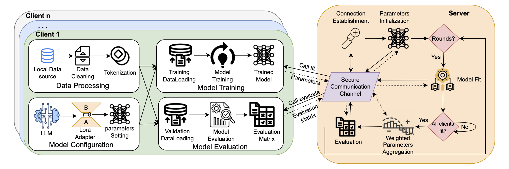
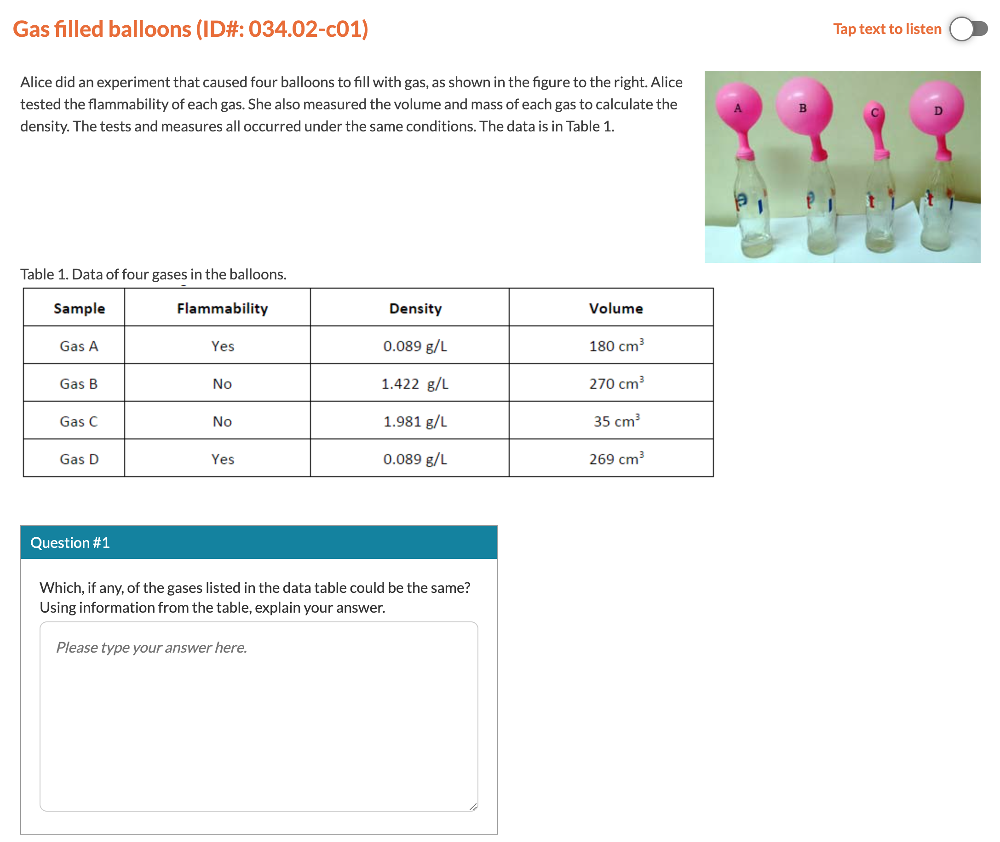

# Federated Learning with Privacy Preservation

This repository contains an implementation of a **Federated Learning** setup for educational assessments. The project uses the `Maykeye/TinyLLama-v0` model and demonstrates federated training across multiple school clients without sharing raw data, maintaining data privacy.

## Features
- Federated training for collaboratively fine-tuning `TinyLlama-v0` on mathematical problems.
- Utilizes the NGSS dataset for training.
- LoRA-based fine-tuning for lightweight and efficient adaptation.
- Support for training on multiple devices without using PyTorch distribution techniques.
- Compatibility with `MLX` for Apple Mac Silicon devices.

### Architectural Diagram
Below is a visual representation of the Federated Learning architecture used in this project:



---

## Federated Learning Implementation with Flower Framework

### Why Use Flower Framework?
The `Flower` framework is chosen for this project because it simplifies the implementation of federated learning by providing:
- **Flexibility**: Flower allows for easy customization of server and client strategies.
- **Cross-Platform Support**: It works seamlessly across different hardware and software environments, including Mac Silicon devices.
- **Ease of Use**: Provides built-in tools for aggregation, communication, and orchestration of federated learning systems, reducing boilerplate code.
- **Scalability**: Supports scaling to multiple clients without significant changes to the code.
- **Framework Agnostic**: Compatible with PyTorch, TensorFlow, and other ML frameworks.

### Implementation Details
Federated learning in this project is implemented as follows:

1. **Server**:
   - Coordinates training rounds.
   - Receives model updates from clients, aggregates them, and sends the global model back to clients.
   - Uses Flower's `FedAvg` strategy for aggregating client updates.

2. **Clients**:
   - Each client performs local training on its own data without sharing raw data with the server.
   - After local training, clients send their model updates (parameters) back to the server.

3. **Communication**:
   - The server and clients communicate over a specified network address (e.g., `127.0.0.1:8080`), which can be customized for distributed setups.


### Why Use FedAvg?
`FedAvg` (Federated Averaging) is used as the aggregation strategy in this project because:
- The data across clients is **balanced**, and all clients contribute equally to the global model.
- There are no adversarial or malicious clients in this setup, making `FedAvg` a simple and effective choice.
- It efficiently averages model updates based on dataset sizes, ensuring that larger datasets contribute proportionally.

#### Key Benefits of FedAvg:
- **Simplicity**: Easy to implement and computationally efficient.
- **Robustness**: Performs well in non-adversarial environments.
- **Scalability**: Can handle a large number of clients with minimal adjustments.

### How to Change the Aggregation Strategy
While `FedAvg` is the default, you can switch to other aggregation strategies based on specific use cases:

1. **Non-IID Data Across Clients (e.g., Heterogeneous Data)**:
   Use `FedProx`, which introduces a proximal term to limit client updates from diverging too far from the global model.
   ```python
   from flwr.server.strategy import FedProx

   strategy = FedProx(
       fraction_fit=1.0,
       fraction_evaluate=1.0,
       min_fit_clients=1,
       min_evaluate_clients=1,
       min_available_clients=1,
       proximal_mu=0.1,  # Regularization term
   )
   ```

2. **Faulty or Adversarial Clients**:
   Use robust aggregation strategies like **Trimmed Mean** or **Median** to handle outliers.

3. **Personalized Models for Clients**:
   Use **Per-FedAvg** for personalized models by adding local fine-tuning after global updates.
   ```python
   from flwr.server.strategy import FedAvg

   strategy = FedAvg(
       fraction_fit=1.0,
       fraction_evaluate=1.0,
       min_fit_clients=1,
       min_evaluate_clients=1,
       min_available_clients=1,
       on_fit_config_fn=lambda cid: {"personalization": True},
   )
   ```

4. **High Data Heterogeneity and Drift**:
   Use **Scaffold** to correct client drift by introducing control variates.

---


### Code Flow
- **Server:**
  The server is started using the `server.py` script. It initializes the federated learning strategy and coordinates the communication with clients.
  ```python
  python server.py
  ```
- **Clients:**
  Each client is started using the `client.py` script. The script connects to the server, performs local training, and sends updates back.
  ```python
  python client.py --client_id <client_id>
  ```

### Example Configuration
The `FedAvg` strategy is used to aggregate updates from clients. Here is a snippet of the server-side configuration:
```python
global_model_parameters = None
total_rounds = 3
num_clients = 3
class CustomFedAvg(fl.server.strategy.FedAvg):
    def aggregate_evaluate(self, rnd, results, failures):
        # Optionally, process evaluation results here
        return super().aggregate_evaluate(rnd, results, failures)

    def aggregate_fit(self, rnd, results, failures):
        # Aggregate model parameters as usual
        aggregated_parameters = super().aggregate_fit(rnd, results, failures)
        if rnd == total_rounds:  # Save the global model at the final round
            nonlocal global_model_parameters
            global_model_parameters = aggregated_parameters[0]
        return aggregated_parameters

strategy = CustomFedAvg(
    fraction_fit=1.0,
    fraction_evaluate=1.0,
    min_fit_clients=num_clients,
    min_evaluate_clients=num_clients,
    min_available_clients=num_clients,
)
# Start Flower server
fl.server.start_server(
    server_address="127.0.0.1:8080",
    config=fl.server.ServerConfig(num_rounds=total_rounds),
    strategy=strategy,
)
```

The client-side script handles local training with its dataset and sends model parameters back to the server:
```python
def fit(self, parameters, config):
    set_params(self.model, parameters)
    train(self.model, self.trainloader)
    return get_params(self.model), len(self.trainloader), {}
```

---

## Dataset Details

This research leverages pre-existing, locally maintained datasets from multiple disjoint school systems, where each school retains control over its own assessment data. The dataset comprises student responses from middle school students evaluated by expert raters across nine multi-label assessment tasks from the PASTA project [1][2]. These tasks are grounded in the Next Generation Science Standards (NGSS), which emphasize students’ ability to apply disciplinary core ideas (DCIs), crosscutting concepts (CCCs), and science and engineering practices (SEPs) in scientific explanations.

Importantly, all participating schools implemented the same assessment tasks aligned with NGSS middle school-level expectations, ensuring a consistent evaluation framework across institutions. However, substantial heterogeneity still arises due to several practical and contextual factors unrelated to curriculum design. For example, teachers across schools differ in how they prepare students for NGSS-aligned tasks—varying in emphasis, scaffolding, and instructional pacing. This leads to differences in how students conceptualize and articulate their scientific reasoning, even when responding to identical prompts. Participating schools span geographically and socioeconomically diverse regions of the United States. Variations in students' reading comprehension, language background, and prior exposure to scientific terminology influence response patterns and vocabulary usage in open-ended tasks. Although expert raters were trained and followed a structured rubric, localized interpretations of nuanced student responses can introduce inter-institutional annotation drift, particularly on subjective items involving scientific explanation. Lastly, differences in digital access, testing environments (e.g., paper-based vs. digital), and student comfort with typing extended responses may affect response quality and structure.

These factors result in institution-specific response distributions that lead each client (school) to learn slightly different model parameters—even when trained on the same NGSS-aligned tasks. Thus, using a single centralized model without accounting for this heterogeneity risks overfitting to dominant patterns and marginalizing underrepresented groups.

  
*Figure: Illustrative Multi-label Task – Gas-Filled Balloons*

A total of approximately 1,200 students from grades 6 through 8 across various geographically dispersed school systems participated in this study. After data cleaning and filtering, each task retained slightly fewer than 1,200 responses (exact numbers shown in the table below). Teachers from participating schools voluntarily integrated these NGSS-aligned science tasks into their instruction [3], and all student responses were stored locally, never leaving the jurisdiction of the school or district. This data governance model complies with privacy regulations and reflects the operational reality of many non-commercial education research settings, such as grant-funded studies or district-level pilots, where centralized data pooling is either infeasible or prohibited.

The assessment tasks were sourced from the Next Generation Science Assessment (NGSA) initiative [1], which focuses on the “Matter and Its Characteristics” domain. Tasks required students to analyze data, recognize patterns, and apply chemistry principles to distinguish among substances based on observable and measurable properties.

For instance, in the “Gas-Filled Balloons” task (shown above), students had to identify different gases by comparing their observed characteristics to reference data. Success depended on understanding density, flammability, and patterns in tabular data—skills that integrate SEP, DCI, and CCC dimensions.

Student responses were evaluated using a structured scoring rubric that captured five reasoning categories: SEP+DCI, SEP+CCC, and DCI alone. These dimensions align with the NGSS framework and support the evaluation of students’ multidimensional reasoning skills [4]. A detailed rubric used for this task is shown in Table: *rubric_gas_filled_ballon*.

By keeping student data decentralized and applying federated learning, each school benefits from privacy-preserving model updates while contributing to a collaboratively trained global model. This setup supports fairness, respects data sovereignty, and ensures that the federated model generalizes across diverse educational environments—without assuming uniformity in student expression or institutional conditions.

### Dataset Information

| ID     | Item                          | No. Labels | Training Size | Testing Size |
|--------|-------------------------------|------------|----------------|---------------|
| Task 1 | Anna vs Carla                 | 4          | 955            | 239           |
| Task 2 | Breaking Down Hydrogen Peroxide | 4        | 666            | 167           |
| Task 3 | Carlos Javier Atomic Model    | 5          | 956            | 240           |
| Task 4 | Dry Ice Model                 | 3          | 1111           | 278           |
| Task 5 | Gas Filled Balloon            | 3          | 958            | 240           |
| Task 6 | Layers in Test Tube           | 10         | 956            | 240           |
| Task 7 | Model For Making Water        | 5          | 836            | 210           |
| Task 8 | Nami Careful Experiment       | 6          | 653            | 164           |
| Task 9 | Natural Sugar                 | 5          | 956            | 239           |

---

## Setup and Installation

### **1. Clone the Repository**
```bash
git clone <repository_url>
cd <repository_name>
```

### **2. Create a Virtual Environment**
It is recommended to set up a Python virtual environment to manage dependencies.

```bash
# Create and activate virtual environment
python3 -m venv venv
source venv/bin/activate  # For Linux/Mac
venv\Scripts\activate     # For Windows
```

### **3. Install Dependencies**
Install the required libraries from the `requirements.txt` file.

```bash
pip install -r requirements.txt
```

---

## Running the Server and Clients

The Federated Learning system consists of a central **server** and multiple **clients**. The server coordinates the training, while clients perform local updates on their data.

### **1. Start the Server**
Run the following command to start the server:
```bash
python server.py
```

- By default, the server listens on `127.0.0.1:8080`.
- To modify the server configuration (e.g., number of rounds), edit the `server.py` file.

### **2. Start the Clients**
Run the following command to start a client:
```bash
python client.py --client_id <client_id>
```

- Replace `<client_id>` with the unique ID of the client (e.g., `0`, `1`, `2`, etc.).
- Multiple clients can be started simultaneously by running the above command in separate terminals.

---

## Running Inference

After federated training is complete, you can use the trained model for inference.

### **Run Inference**
```bash
python inference.py
```
- The inference code randomly select 10 samples from the dataset for inferencing.

---

## Project Structure
```
├── client.py           # Client-side federated training implementation
├── server.py           # Server-side orchestration for federated learning
├── inference.py        # Script for running inference with the trained model
├── requirements.txt    # Python dependencies
├── README.md           # Project documentation
└── utils.py            # Utility functions for preprocessing and evaluation
```

---

## References

[1] Harris, C. J., et al. (2024). *Creating assessments aligned with NGSS: The PASTA Project*.  
[2] PASTA Project (2023). *Public Assessments for Science Teaching and Achievement*.  
[3] Zhai, X., et al. (2022). *Applying NGSS-aligned tasks in middle school science education*.  
[4] He, Y., et al. (2024). *Evaluating multidimensional reasoning in science using SEP, DCI, and CCC frameworks*.

---
## License
This project is licensed under the [MIT License](LICENSE).